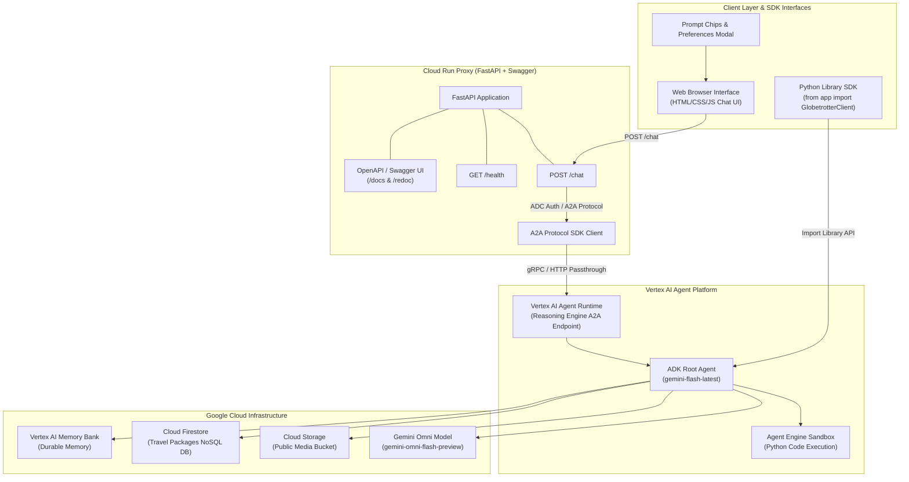

# Build with Gemini · Track 3 — Complete Agent Architecture & Blueprint Guide

This guide provides an end-to-end blueprint for building, testing, documenting, and deploying production AI agents using **Google Agent Development Kit (ADK)**, **Vertex AI Agent Runtime**, **A2UI**, **FastAPI**, **Cloud Run**, and publishing as a **Public Python Library**.

---

## 🏛️ System Architecture Diagram



---

## 🐍 Public Python Library API (`app/api.py`)

The agent can be imported and executed directly in Python applications as a reusable library:

### 1. Installation
Install locally or build a wheel package:
```bash
pip install .
```

### 2. Synchronous Usage
```python
from app import run_agent_query, GlobetrotterClient

# Functional Quick API
res = run_agent_query("Calculate a 7-day travel budget for Tokyo in JPY and EUR")
print(res["text"])

# Client Class API
client = GlobetrotterClient(user_id="python-app-user")
print(client.list_available_tools())
res = client.query("Search packages for Bali beach getaway")
print(res["text"])
```

### 3. Asynchronous Usage
```python
import asyncio
from app import GlobetrotterClient

async def main():
    client = GlobetrotterClient(user_id="async-service")
    res = await client.async_query("Generate a preview video for a Kyoto tea ceremony")
    print(res["text"])

asyncio.run(main())
```

---

## 📑 Swagger / OpenAPI Documentation

The FastAPI proxy server exposes interactive OpenAPI/Swagger documentation out of the box:

* **Swagger UI**: `https://<YOUR_CLOUD_RUN_URL>/docs`
* **ReDoc**: `https://<YOUR_CLOUD_RUN_URL>/redoc`

### Key Endpoints

#### 1. `GET /health`
* **Summary**: Service Health Check
* **Tags**: `System`
* **Response**: `200 OK`
```json
{
  "status": "ok",
  "service": "globetrotter-frontend",
  "resource": "projects/952170692401/locations/us-central1/reasoningEngines/7112427909024841728"
}
```

#### 2. `POST /chat`
* **Summary**: Forward Chat Query to Agent Runtime
* **Tags**: `Chat`
* **Request Body**:
```json
{
  "message": "Search packages for Tokyo & Bali",
  "user_id": "web-user-123"
}
```

---

## 🧪 Comprehensive Testing Suite

### 1. Library API Unit Tests (`tests/unit/test_api.py`)
```python
import pytest
from app import GlobetrotterClient, run_agent_query

def test_globetrotter_client_tools_list():
    client = GlobetrotterClient()
    tools = client.list_available_tools()
    assert "search_travel_packages" in tools

@pytest.mark.asyncio
async def test_async_query():
    client = GlobetrotterClient(user_id="test-user")
    res = await client.async_query("What to visit in Tokyo?")
    assert res["status"] == "success"
```

### 2. Run All Unit & API Tests
```bash
./.venv/bin/pytest tests/unit/ -v
```

---

## 🚀 Starter Template: Build a New Similar App

To build a new AI agent application from this guide, copy these starter templates:

### 1. `agents-cli-manifest.yaml`
```yaml
name: my-custom-agent
acli_version: 1.1.0
agent_directory: app
region: us-central1
language: python
create_params:
  deployment_target: agent_runtime
  is_a2a: true
```

### 2. `app/agent.py`
```python
from google.adk import Agent, App
from google.adk.models import Gemini

def hello_tool(name: str) -> str:
    """Returns a greeting."""
    return f"Hello, {name}! Welcome to your custom AI agent."

root_agent = Agent(
    name="root_agent",
    model=Gemini(model="gemini-flash-latest"),
    instruction="You are a helpful AI assistant built on ADK.",
    tools=[hello_tool],
)

app = App(root_agent=root_agent)
```

### 3. Deploy Commands
```bash
# 1. Deploy Agent Runtime
agents-cli deploy agent-engine --project YOUR_PROJECT_ID --region us-central1

# 2. Deploy Cloud Run Frontend
gcloud run deploy my-custom-frontend \
  --source ./frontend \
  --region us-central1 \
  --allow-unauthenticated \
  --set-env-vars="AGENT_ENGINE_RESOURCE_NAME=YOUR_RESOURCE_NAME,AGENT_DIRECTORY=app"
```
