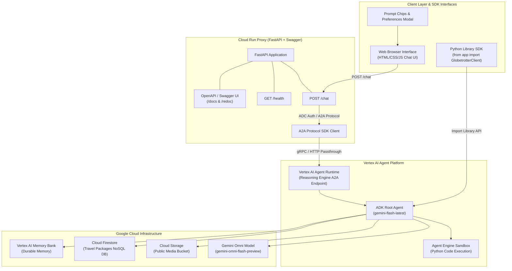

# Build with Gemini · Track 3 — Complete Agent Architecture & Blueprint Guide

This guide provides an end-to-end blueprint for building, testing, documenting, and deploying production AI agents using **Google Agent Development Kit (ADK)**, **Vertex AI Agent Runtime**, **A2UI**, **FastAPI**, **Cloud Run**, and publishing as a **Public Python Library** with separate **`dev`** and **`live`** environment configurations.

---

## ⚙️ Environment Configuration (`dev` vs `live`)

Maintain separate configuration profiles for local sandbox development (`dev`) and production deployment (`live`):

```bash
# Activate Sandbox / Dev Environment
export APP_ENV=dev

# Activate Live / Production Environment
export APP_ENV=live
```

### Environment Profile Files

* `.env.dev`:
```ini
APP_ENV=dev
GOOGLE_CLOUD_PROJECT=your-dev-project-id
GOOGLE_CLOUD_LOCATION=us-central1
GCS_BUCKET_NAME=your-dev-media-bucket
USE_CODE_SANDBOX=true
```

* `.env.prod`:
```ini
APP_ENV=live
GOOGLE_CLOUD_PROJECT=your-prod-project-id
GOOGLE_CLOUD_LOCATION=us-central1
GCS_BUCKET_NAME=your-prod-media-bucket
AGENT_ENGINE_RESOURCE_NAME=projects/your-prod-project-id/locations/us-central1/reasoningEngines/your-id
USE_CODE_SANDBOX=true
```

---

## 🏛️ System Architecture Diagram



---

## 🔄 Lifecycle: Build, Test, Deploy

### 1. Build Phase
```bash
# Build python package wheel
pip install build
python -m build
```

### 2. Test Phase
```bash
# Execute test suite against dev environment
APP_ENV=dev ./.venv/bin/pytest tests/unit/ tests/contract/ -v
```

### 3. Deploy Phase
```bash
# 1. Deploy Agent Runtime to Agent Platform
APP_ENV=live agents-cli deploy agent-engine --project YOUR_PROJECT_ID --region us-central1

# 2. Deploy Cloud Run Frontend Service
gcloud run deploy my-custom-frontend \
  --source ./frontend \
  --region us-central1 \
  --allow-unauthenticated \
  --set-env-vars="APP_ENV=live,AGENT_ENGINE_RESOURCE_NAME=YOUR_RESOURCE_NAME,AGENT_DIRECTORY=app"
```

---

## 🐍 Public Python Library API (`app/api.py`)

The agent can be imported and executed directly in Python applications as a reusable library:

### 1. Installation
Install locally or build a wheel package:
```bash
pip install .
```

### 2. Synchronous Usage
```python
from app import run_agent_query, GlobetrotterClient

# Functional Quick API
res = run_agent_query("Calculate a 7-day travel budget for Tokyo in JPY and EUR")
print(res["text"])

# Client Class API
client = GlobetrotterClient(user_id="python-app-user")
print(client.list_available_tools())
res = client.query("Search packages for Bali beach getaway")
print(res["text"])
```

### 3. Asynchronous Usage
```python
import asyncio
from app import GlobetrotterClient

async def main():
    client = GlobetrotterClient(user_id="async-service")
    res = await client.async_query("Generate a preview video for a Kyoto tea ceremony")
    print(res["text"])

asyncio.run(main())
```

---

## 📑 Swagger / OpenAPI Documentation

The FastAPI proxy server exposes interactive OpenAPI/Swagger documentation out of the box:

* **Swagger UI**: `https://<YOUR_CLOUD_RUN_URL>/docs`
* **ReDoc**: `https://<YOUR_CLOUD_RUN_URL>/redoc`

### Key Endpoints

#### 1. `GET /health`
* **Summary**: Service Health Check
* **Tags**: `System`
* **Response**: `200 OK`
```json
{
  "status": "ok",
  "service": "globetrotter-frontend",
  "resource": "projects/952170692401/locations/us-central1/reasoningEngines/7112427909024841728"
}
```

#### 2. `POST /chat`
* **Summary**: Forward Chat Query to Agent Runtime
* **Tags**: `Chat`
```json
{
  "message": "Search packages for Tokyo & Bali",
  "user_id": "web-user-123"
}
```

---

## 🧪 Comprehensive Testing Suite

### 1. Config Unit Tests (`tests/unit/test_config.py`)
```python
import os
from unittest.mock import patch
from app.config import load_config

def test_load_config_dev():
    with patch.dict(os.environ, {"APP_ENV": "dev", "GOOGLE_CLOUD_PROJECT": "test-project-dev"}):
        cfg = load_config()
        assert cfg.env == "dev"
        assert cfg.project_id == "test-project-dev"
```

### 2. Run All Tests
```bash
./.venv/bin/pytest tests/unit/ tests/contract/ -v
```
