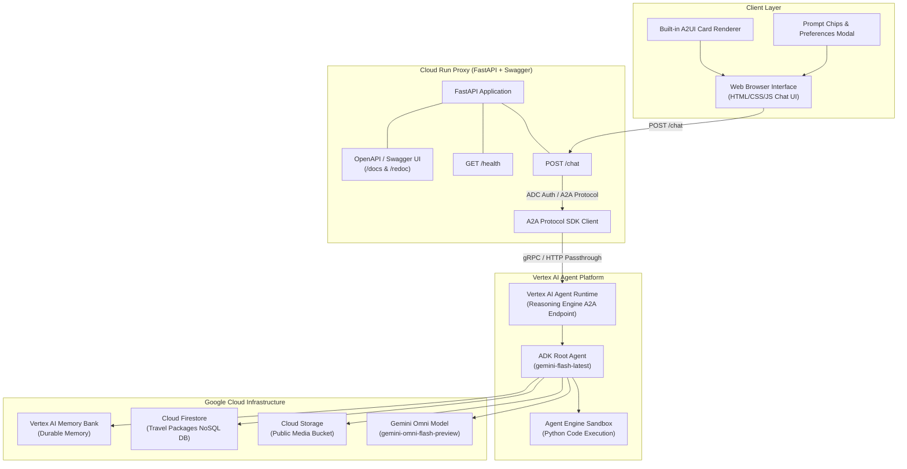
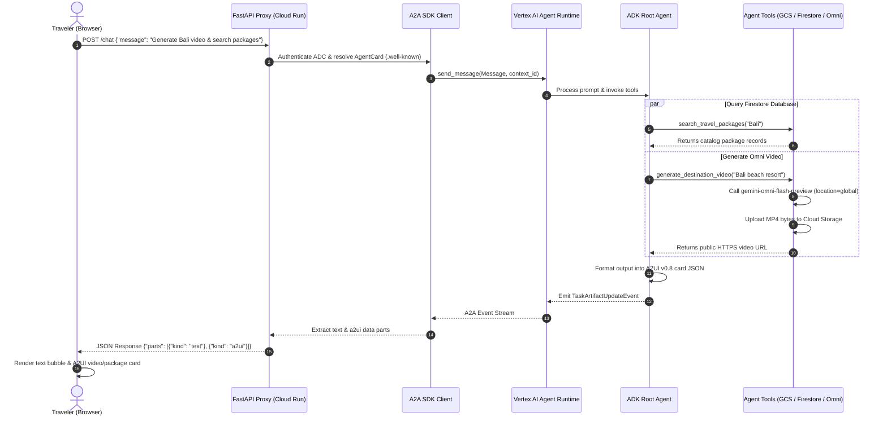

# Build with Gemini · Track 3 — Complete Agent Architecture & Blueprint Guide

This guide provides an end-to-end blueprint for building, testing, documenting, and deploying production AI agents using **Google Agent Development Kit (ADK)**, **Vertex AI Agent Runtime**, **A2UI**, **FastAPI**, and **Cloud Run**.

---

## 🏛️ System Architecture Diagram



---

## 🔄 End-to-End Sequence Flow Diagram



---

## 📑 Swagger / OpenAPI Documentation

The FastAPI proxy server exposes interactive OpenAPI/Swagger documentation out of the box:

* **Swagger UI**: `https://<YOUR_CLOUD_RUN_URL>/docs`
* **ReDoc**: `https://<YOUR_CLOUD_RUN_URL>/redoc`

### Key Endpoints

#### 1. `GET /health`
* **Summary**: Service Health Check
* **Tags**: `System`
* **Response**: `200 OK`
```json
{
  "status": "ok",
  "service": "globetrotter-frontend",
  "resource": "projects/952170692401/locations/us-central1/reasoningEngines/7112427909024841728"
}
```

#### 2. `POST /chat`
* **Summary**: Forward Chat Query to Agent Runtime
* **Tags**: `Chat`
* **Request Body**:
```json
{
  "message": "Search packages for Tokyo & Bali",
  "user_id": "web-user-123"
}
```
* **Response Payload (`200 OK`)**:
```json
{
  "parts": [
    {
      "kind": "text",
      "text": "Here are the top travel packages matching your search:"
    },
    {
      "kind": "a2ui",
      "data": {
        "surfaceUpdate": {
          "components": [
            {
              "card": {
                "title": "Tokyo Cultural Discovery",
                "description": "7 days exploring Shibuya, Asakusa, and Mt. Fuji. Price: $2,499."
              }
            }
          ]
        }
      }
    }
  ]
}
```

---

## 🧪 Comprehensive Testing Suite

### 1. Unit Tests (`tests/unit/test_video_tools.py`)
```python
import pytest
from unittest.mock import MagicMock, patch
from app.video_tools import generate_destination_video

@patch("app.video_tools.genai.Client")
@patch("app.video_tools.storage.Client")
def test_generate_destination_video(mock_storage, mock_genai):
    mock_interactions = MagicMock()
    mock_genai.return_value.interactions = mock_interactions
    
    # Mock video generation response
    mock_response = MagicMock()
    mock_response.output_video.data = b"fake_mp4_bytes"
    mock_interactions.create.return_value = mock_response

    # Mock GCS upload
    mock_bucket = MagicMock()
    mock_storage.return_value.bucket.return_value = mock_bucket

    url = generate_destination_video("Bali sunset")
    
    assert "https://storage.googleapis.com/" in url
    mock_interactions.create.assert_called_once_with(
        model="gemini-omni-flash-preview", input="Bali sunset"
    )
```

### 2. Integration Tests (`tests/integration/test_agent.py`)
```python
import pytest
from app.agent import root_agent

def test_root_agent_initialization():
    assert root_agent.name == "root_agent"
    assert len(root_agent.tools) > 0
```

### 3. Run All Tests
```bash
pytest tests/unit/ tests/integration/ -v
```

---

## 🚀 Starter Template: Build a New Similar App

To build a new AI agent application from this guide, copy these starter templates:

### 1. `agents-cli-manifest.yaml`
```yaml
name: my-custom-agent
acli_version: 1.1.0
agent_directory: app
region: us-central1
language: python
create_params:
  deployment_target: agent_runtime
  is_a2a: true
```

### 2. `app/agent.py`
```python
from google.adk import Agent, App
from google.adk.models import Gemini

def hello_tool(name: str) -> str:
    """Returns a greeting."""
    return f"Hello, {name}! Welcome to your custom AI agent."

root_agent = Agent(
    name="root_agent",
    model=Gemini(model="gemini-flash-latest"),
    instruction="You are a helpful AI assistant built on ADK.",
    tools=[hello_tool],
)

app = App(root_agent=root_agent)
```

### 3. Deploy Commands
```bash
# 1. Deploy Agent Runtime
agents-cli deploy agent-engine --project YOUR_PROJECT_ID --region us-central1

# 2. Deploy Cloud Run Frontend
gcloud run deploy my-custom-frontend \
  --source ./frontend \
  --region us-central1 \
  --allow-unauthenticated \
  --set-env-vars="AGENT_ENGINE_RESOURCE_NAME=YOUR_RESOURCE_NAME,AGENT_DIRECTORY=app"
```
